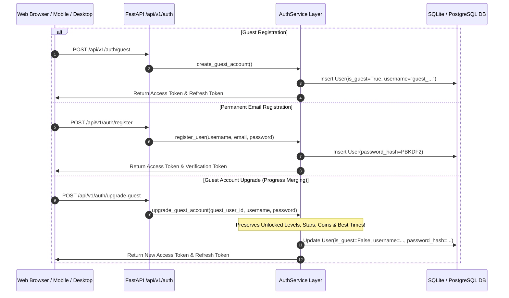

# Arrow Escape Authentication & Cross-Platform Account System

Technical documentation for the **Arrow Escape** authentication system, JWT token lifecycle, Guest account upgrade engine, and OAuth 2.0 integration.

---

## 🔐 1. Authentication Flow Diagram

---

## 🔑 2. JWT Token Specifications

- **Access Token**:
  - Expiration: $60\text{ minutes}$
  - Header: `Authorization: Bearer <access_token>`
  - Payload: `{"sub": "<user_id>", "username": "<name>", "is_guest": false, "exp": 1750000000}`
- **Refresh Token**:
  - Expiration: $30\text{ days}$
  - Storage: Database table `refresh_tokens` with revocation support.

---

## 🌐 3. REST API Endpoint Reference

| Method | Endpoint | Description |
| :--- | :--- | :--- |
| `POST` | `/api/v1/auth/guest` | Instant guest account generation. |
| `POST` | `/api/v1/auth/register` | Permanent user registration with password hashing. |
| `POST` | `/api/v1/auth/login` | Standard username/password authentication. |
| `POST` | `/api/v1/auth/upgrade-guest` | Upgrades guest account to permanent account without losing progress. |
| `POST` | `/api/v1/auth/refresh` | Generates a fresh Access Token using a valid Refresh Token. |
| `POST` | `/api/v1/auth/logout` | Revokes the specified Refresh Token. |
| `POST` | `/api/v1/auth/google` | OAuth 2.0 integration endpoint stub. |
| `POST` | `/api/v1/auth/verify-email` | Verifies user email address via token. |
| `POST` | `/api/v1/auth/forgot-password` | Generates password reset token. |
| `POST` | `/api/v1/auth/reset-password` | Resets user password using valid token. |
| `GET` | `/api/v1/auth/me` | Retrieves current user profile & account metadata. |
| `GET` | `/api/v1/auth/sessions` | Lists active sessions & login history for current user. |
| `DELETE` | `/api/v1/auth/sessions/{id}` | Revokes specific session. |
