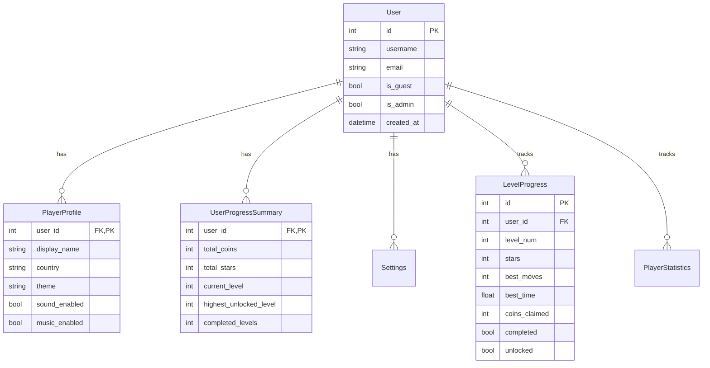

# Arrow Escape Backend Architecture & API Specification

Comprehensive architectural specification for the **Arrow Escape** FastAPI backend, database schema, repository-service pattern, and cloud save synchronization engine.

---

## 🏗️ 1. Layered Folder Architecture

```text
backend/app/
├── main.py                  # FastAPI Application & Exception Handlers
├── core/
│   ├── config.py            # Envs & Configuration
│   ├── logger.py            # Structured Logging
│   └── security.py          # Hashing & Token Utils
├── db/
│   ├── session.py           # Database Engine & Session Generator
│   ├── base_class.py        # SQLAlchemy Base Declarations
│   └── init_db.py           # DB Seeding Script
├── models/                  # SQLAlchemy ORM Models
│   ├── user.py              # User, PlayerProfile, UserProgressSummary, Settings
│   ├── game.py              # Level, LevelProgress, DailyChallenge
│   └── stats.py             # PlayerStatistics
├── schemas/                 # Pydantic Schemas
│   ├── common.py            # Standardized API Error & Response Models
│   ├── progress.py          # CloudSync Request & Response Schemas
│   └── stats.py             # Statistics Request & Response Schemas
├── repositories/            # Database Access Layer (Clean Queries)
│   ├── player_repo.py       # Player & Profile Queries
│   └── progress_repo.py     # Level & Progress Queries
├── services/                # Business Logic Layer
│   ├── sync_service.py      # Cloud Sync & Conflict Resolution Engine
│   └── player_service.py    # Profile & Settings Services
└── api/v1/                  # REST Controllers
    ├── health.py            # GET /api/v1/health
    ├── cloud.py             # POST /api/v1/cloud/sync
    ├── profile.py           # GET, PATCH /api/v1/profile
    ├── stats.py             # GET, PATCH /api/v1/stats
    ├── settings.py          # GET, PATCH /api/v1/settings
    ├── levels.py            # GET /api/v1/levels & /api/v1/levels/{id}
    └── leaderboard.py       # GET /api/v1/leaderboard
```

---

## 🗄️ 2. Database Entity-Relationship (ER) Diagram



---

## ☁️ 3. Cloud Save & Conflict Resolution Engine

`POST /api/v1/cloud/sync` synchronizes client progress arrays with the cloud backend using deterministic conflict resolution:

1. **Highest Progress Wins**:
   - Level Stars: $\max(\text{old\_stars}, \text{client\_stars})$
   - Coins Claimed: Incremental reward calculation based on new max stars.
   - Best Moves & Best Time: Preserves lowest (fastest/least moves) non-zero record.
   - Completed & Unlocked Levels: Monotonically increasing unlock state up to level 50.
2. **Newest Timestamp Wins**:
   - User settings, theme selections, and profile customizations overwrite older server records.

---

## 🌐 4. API Endpoint Reference

| HTTP Method | Route Endpoint | Description |
| :--- | :--- | :--- |
| `GET` | `/api/v1/health` | Service health check returning `{"status": "ok"}`. |
| `GET` | `/api/v1/config` | Global game config (total levels = 50, max stars = 150, thresholds). |
| `GET` | `/api/v1/levels` | List metadata for all official levels. |
| `GET` | `/api/v1/levels/{id}` | Retrieve specific level layout JSON. |
| `POST` | `/api/v1/cloud/sync` | Primary Cloud Save delta sync with conflict resolution. |
| `GET` | `/api/v1/profile` | Retrieve user profile information. |
| `PATCH` | `/api/v1/profile` | Update user profile preferences. |
| `GET` | `/api/v1/stats` | Retrieve aggregated player gameplay statistics. |
| `PATCH` | `/api/v1/stats` | Update player gameplay statistics. |
| `GET` | `/api/v1/settings` | Retrieve user audio/video settings. |
| `PATCH` | `/api/v1/settings` | Update user audio/video settings. |
| `GET` | `/api/v1/leaderboard` | Get global rankings by stars, coins, or completed levels. |
