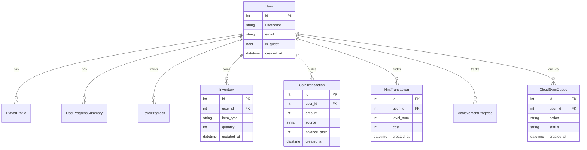

# Arrow Escape Database Schema & Production Architecture

Technical documentation for the **Arrow Escape** PostgreSQL database schema, Alembic migration workflow, Inventory & Transaction Auditing, Redis-ready Caching, and Disaster Recovery Backup strategies.

---

## 🗄️ 1. Entity-Relationship (ER) Diagram



---

## 🔄 2. Alembic Migration Workflow

Database schema changes are managed strictly using **Alembic** migrations:

1. **Generate Migration Script**:
   ```bash
   alembic revision --autogenerate -m "Add inventory and transaction audit tables"
   ```
2. **Apply Migrations**:
   ```bash
   alembic upgrade head
   ```
3. **Rollback Migration**:
   ```bash
   alembic downgrade -1
   ```

---

## ⚡ 3. Redis-Ready Caching Architecture

Non-sensitive data (Player Profiles, Global Game Config, Level Metadata) is cached using an in-memory / Redis cache manager (`backend/app/core/cache.py`):
- **TTL**: 300 seconds (default).
- **Cache Eviction**: Automatic invalidation on profile updates (`PATCH /api/v1/profile`).

---

## 💾 4. Backup & Disaster Recovery Strategy

- **Daily Backups**: Automated PostgreSQL `pg_dump` snapshot taken daily at 02:00 UTC.
- **Retention**: Daily backups retained for 30 days; weekly backups retained for 52 weeks.
- **Point-in-Time Recovery (PITR)**: Write-Ahead Logging (WAL) archiving enabled for sub-minute disaster recovery.
