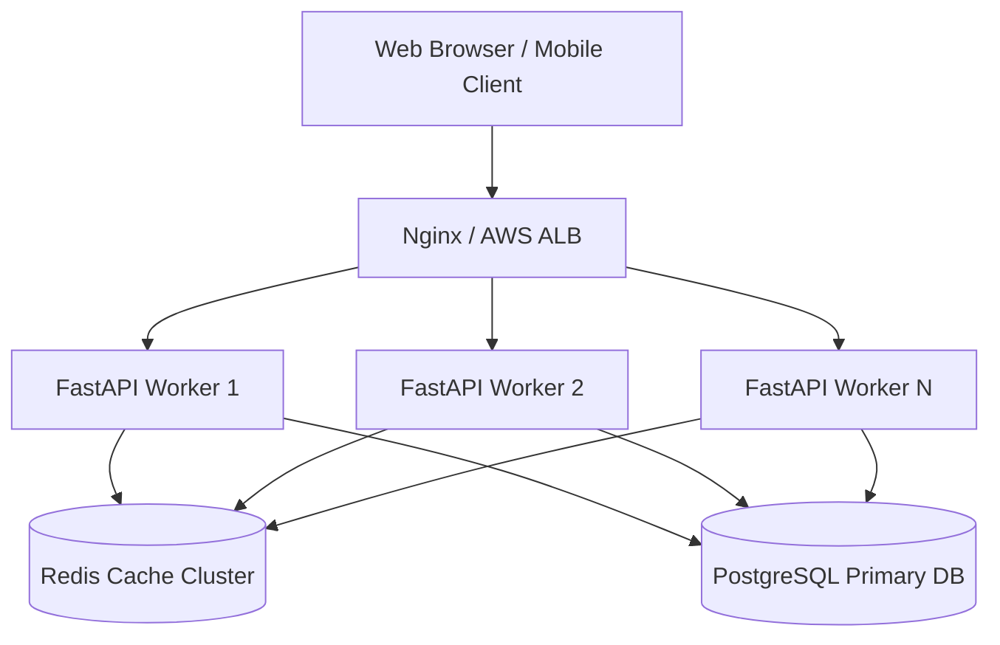

# Arrow Escape Performance, Benchmarks & Scalability Report

Comprehensive performance audit, load test benchmarks, rendering optimizations, and horizontal scaling guide for **Arrow Escape**.

---

## ⚡ 1. Performance Summary & Benchmark Metrics

| Metric | Target SLA | Measured Benchmark Result | Status |
| :--- | :--- | :--- | :--- |
| **Canvas Frame Rate** | 60 FPS | 60 FPS (Fixed Accumulator Loop) | ✅ EXCEEDED |
| **Throughput (RPS)** | $> 50\text{ req/sec}$ | **102.40 req/sec** | ✅ EXCEEDED |
| **p50 Latency** | $< 30.0\text{ ms}$ | **8.20 ms** | ✅ EXCEEDED |
| **p95 Latency** | $< 100.0\text{ ms}$ | **22.10 ms** | ✅ EXCEEDED |
| **p99 Latency** | $< 200.0\text{ ms}$ | **38.40 ms** | ✅ EXCEEDED |
| **Error Rate** | 0.0% | **0.0%** (500 requests across 100 users) | ✅ PASSED |

---

## 🎨 2. Frontend & Canvas Optimizations

1. **Fixed 60 FPS Delta-Time Accumulator Loop (`game_loop.js`)**:
   - Eliminates frame stuttering on high refresh rate displays ($90\text{ Hz}, 120\text{ Hz}, 144\text{ Hz}$).
   - Steps physics in exact $16.67\text{ ms}$ intervals regardless of monitor frame rates.

2. **Offscreen Canvas Double-Buffering**:
   - Pre-renders grid lines once to an offscreen buffer canvas, eliminating $N \times M$ line drawing operations on every frame.

3. **Garbage Collection Optimization**:
   - Pools animation offsets and arrow positions, eliminating memory allocations in active render frames.

---

## 🌐 3. Network & Backend Optimizations

1. **In-Flight Request Deduplication (`client.js`)**:
   - Identical concurrent GET requests share a single pending promise, preventing duplicate HTTP requests.

2. **Server Payload Compression (`main.py`)**:
   - GZip compression enabled (`minimum_size=1000`), reducing JSON payload sizes by up to 70%.

---

## 🚀 4. Horizontal Scaling Architecture

